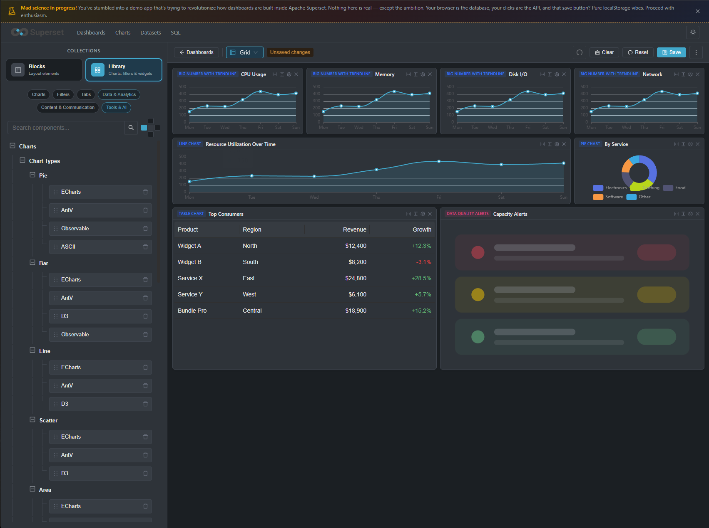
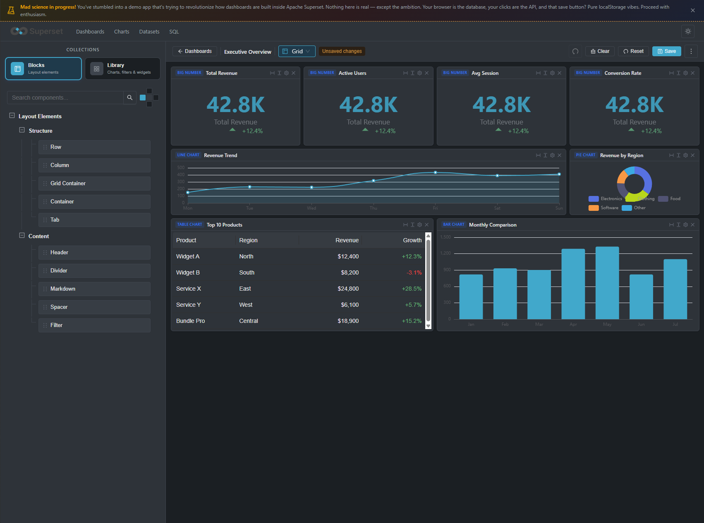

# Superset Dashboard Playground

**[Live Demo](https://superset-dashboard-builder-demo.vercel.app/)**

A drag-and-drop dashboard builder that reimagines how dashboards are created inside [Apache Superset](https://superset.apache.org/). This is a fully client-side prototype — no backend, no database, just your browser doing all the heavy lifting.

> **This is a demo / proof-of-concept.** Nothing is sent to any server. Your browser's `localStorage` is the database, your clicks are the API, and the save button runs on pure localStorage vibes.





---

## What is this?

Superset Dashboard Playground is an experimental frontend that explores a new editing experience for Apache Superset dashboards. Instead of the existing layout system, it offers:

- **Four distinct layout modes** — grid, rows, free-form (XY), and mosaic — each with its own drag-and-drop behavior and positioning logic
- **A component library** with 50+ block types (charts, filters, widgets, layout elements) that you drag onto a canvas
- **Starter templates** to bootstrap common dashboard patterns (executive overviews, sales analytics, operational monitoring, etc.)
- **Real-time layout switching** with an algorithm that intelligently rearranges all elements when you change modes
- **A dockable panel** that can snap to any edge of the screen
- **Dark mode**, undo/redo, fullscreen, and all the editor niceties you'd expect

The goal is to prototype ideas for how dashboard building in Superset could feel more visual, flexible, and intuitive.

---

## Features

### Layout Modes

| Mode          | Description                                                                                                                    |
| ------------- | ------------------------------------------------------------------------------------------------------------------------------ |
| **Grid**      | N-column responsive grid. Charts snap to cells with uniform row heights. Supports column/row spanning.                         |
| **Rows**      | Full-width horizontal rows stacked vertically. Drag to reorder.                                                                |
| **Free (XY)** | Place charts anywhere. Collision detection prevents unwanted overlaps. Expand horizontally/vertically to fill available space. |
| **Mosaic**    | Masonry-style layout. Items fill vertical gaps with variable heights.                                                          |

Switch between modes at any time — the rearrangement algorithm repositions all items to fit the new layout.

### Component Library

**Charts** — Pie, Bar, Line, Scatter, Area, Table, Pivot Table, Big Number, Big Number with Trendline, World Map. Each chart type supports multiple rendering libraries (ECharts, AntV, D3, Observable) with configurable metrics, color schemes, time grains, and display options.

**Filters** — Value, Range, Time, Time Grain, and Time Column filters. Plus a Filter Toolbox (compact global filter UI with presets and scoping) and a Filter Bar (streamlined collapsible filter strip).

**Layout Elements** — Header (H1-H4), Row, Column (12-span grid), Grid Container, Divider, Markdown, Spacer, and Tabs.

**Widgets** — Embedded Chart, Data Quality Alerts, Team Activity Feed, Announcements, Changelog, Quick Links, Pinned Dashboards, Search Box, Recent Databases, Tag Cloud, My Reports Schedule, Certifications, AI Suggestions.

### Starter Templates

11 pre-built templates across 5 categories to get started quickly:

- **Executive & Overview** — Executive Overview, KPI Wall
- **Sales & Revenue** — Sales Analytics, Revenue Breakdown
- **Product & Engagement** — User Engagement, Product Analytics
- **Operations & Monitoring** — Operational Monitoring, Infrastructure Overview
- **Data Quality & Governance** — Data Quality Dashboard, Data Catalog Home

### Dashboard Management

- **New Dashboard Wizard** — 3-step flow: choose layout mode, pick a starting point (blank, preset, saved template, or starter), confirm and create
- **Save / Save As** — Persist to localStorage with named dashboards
- **Properties Editor** — Name, URL slug, owners, color scheme, refresh frequency, certification, JSON metadata
- **Search & Browse** — Filter dashboards by name, toggle list/card view, pin favorites
- **View Mode** — Read-only preview with fullscreen support
- **Export** — JSON export and image export
- **Undo/Redo** — Up to 50 steps of history

### Editor

- **Drag & drop** from the component tree onto the canvas, or reorder items within the canvas
- **Resize** cards in XY mode with drag handles
- **Configure** any component via a settings modal with type-specific fields
- **Clear / Reset** the canvas with confirmation
- **Layout switcher** in the toolbar to change modes on the fly

### UI & Theming

- **Dark mode** — toggle in the header, persisted across sessions
- **Dockable panel** — snap the component panel to left, right, top, or bottom
- **Resizable panel** — drag the edge to adjust panel size
- **Fullscreen mode** — hides the header and panels for distraction-free viewing
- **37 preview components** — each block type has a lightweight visual preview on the canvas

---

## Tech Stack

| Layer       | Technology            |
| ----------- | --------------------- |
| Framework   | React 18 + TypeScript |
| UI Library  | Ant Design (antd) 6.x |
| Charts      | Apache ECharts 6.x    |
| Drag & Drop | dnd-kit               |
| Build       | Vite                  |
| Storage     | Browser localStorage  |

---

## Getting Started

### Prerequisites

- Node.js 18+
- npm or yarn

### Install & Run

```bash
# Install dependencies
npm install

# Start dev server
npm run dev
```

The app will be available at `http://localhost:5173` (or the next available port).

### Build for Production

```bash
npm run build
npm run preview
```

---

## Project Structure

```
src/
├── App.tsx                        # Root component, routing, state
├── constants.ts                   # Layout defaults, dimensions
├── components/
│   ├── DndContextProvider.tsx      # dnd-kit drag-and-drop setup
│   ├── DropCanvas.tsx              # Main canvas with drop handling
│   ├── LeftPanel.tsx               # Dockable component panel
│   ├── ComponentTree.tsx           # Searchable component tree
│   ├── CanvasCard.tsx              # Individual card wrapper
│   ├── BlockSettingsModal.tsx      # Component configuration form
│   ├── DashboardList.tsx           # Dashboard browser
│   ├── DashboardDetail.tsx         # Read-only dashboard view
│   ├── DashboardPropertiesModal.tsx
│   ├── NewDashboardWizard.tsx      # 3-step creation wizard
│   ├── renderers/                  # Layout-specific canvas renderers
│   │   ├── XYCanvas.tsx
│   │   ├── GridCanvas.tsx
│   │   ├── RowsCanvas.tsx
│   │   └── MosaicCanvas.tsx
│   └── previews/                   # 37 block preview components
├── data/
│   ├── blockSettings.ts            # Component config schemas (50+ types)
│   ├── layoutModes.tsx             # Layout mode definitions
│   ├── layoutPresets.tsx           # Pre-configured layout templates
│   ├── starterTemplates.ts         # 11 starter dashboards
│   └── treeData.ts                 # Component library tree structure
├── store/
│   └── templateStore.ts            # localStorage CRUD for dashboards
└── utils/
    └── collision.ts                # Collision detection & layout rearrangement
```

---

## How It Works

### Drag & Drop

Components are dragged from the left panel tree and dropped onto the canvas. The `DndContextProvider` (built on dnd-kit) handles two drag sources:

1. **Tree to Canvas** — creates a new component at the drop position
2. **Canvas to Canvas** — moves or reorders existing components

Drop behavior adapts to the active layout mode: XY mode uses pixel coordinates, Grid mode snaps to cells and swaps occupants, Rows mode reorders vertically.

### Layout Rearrangement

When switching layout modes, the `rearrangeForLayout` algorithm:

1. Sorts all items by their current visual position (top-to-bottom, left-to-right)
2. Assigns new position properties based on the target layout:
   - **Grid** — sequential cell assignment across columns
   - **Rows** — one item per row, ordered
   - **XY** — evenly-spaced pixel grid derived from canvas width
   - **Mosaic** — shortest-column-first (masonry balancing)

### Collision Detection

In XY mode, a spiral-search algorithm finds non-overlapping positions for new items. It radiates outward from the drop point in 10px increments at 15-degree angles until a clear spot is found.

### Persistence

Everything is stored in the browser:

| Key                     | Storage        | Purpose               |
| ----------------------- | -------------- | --------------------- |
| `superset_pb_templates` | localStorage   | Saved dashboards      |
| `superset_pb_default`   | localStorage   | Last working state    |
| `theme`                 | localStorage   | Light/dark preference |
| `demo_dismissed`        | sessionStorage | Banner dismissal      |

---

## Contributing

This is an experimental prototype. Ideas, feedback, and contributions are welcome.

1. Fork the repository
2. Create a feature branch (`git checkout -b feature/my-idea`)
3. Make your changes
4. Run `npm run lint` and `npm run build` to verify
5. Open a pull request

---

## License

This project is provided as-is for demonstration and experimentation purposes.

---

_Built with curiosity and a healthy disregard for backend dependencies._
